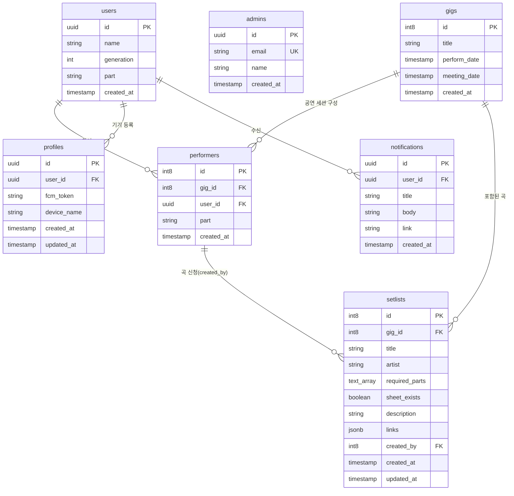

# 데이터베이스 스키마 명세 (Database Schema Specification)

본 문서는 Supabase(PostgreSQL)에 구축된 SOKNA 애플리케이션의 데이터 모델, 테이블 구조, 외래키 관계 및 인덱스/RLS 정책을 정의합니다.

---

## 1. 개체 관계도 (Entity Relationship Diagram)

---

## 2. 테이블 상세 명세 (Table Specifications)

### 2.1 `users` (회원 정보)
동아리 회원의 기본 인적사항, 가입 승인 상태 및 활동 정보를 관리합니다.

| 컬럼명 | 데이터 타입 | Nullable | 기본값 | 설명 |
| :--- | :--- | :--- | :--- | :--- |
| `id` | `uuid` | NO | - | 회원 고유 ID (Supabase auth.users.id 매핑) |
| `name` | `text` | NO | - | 회원 이름 (실명) |
| `generation` | `int4` | YES | null | 동아리 기수 (예: 39) |
| `part` | `text` | YES | null | 주 활동 파트 (보컬, 기타, 베이스, 드럼, 건반, 창작 등) |
| `email` | `text` | YES | null | 회원 이메일 주소 |
| `status` | `text` | NO | `'pending'` | 회원 승인 상태 (`'pending'`, `'approved'`, `'rejected'`) |
| `applied_at` | `timestamptz` | NO | `now()` | 가입 신청 일시 |
| `approved_at` | `timestamptz` | YES | null | 관리자 승인 일시 |
| `marketing_opt_in` | `bool` | NO | `false` | 웹 푸시/행사 소식 수신 선택 동의 여부 |
| `created_at` | `timestamptz` | NO | `now()` | 레코드 생성 일시 |

### 2.2 `admins` (관리자 목록)
공연 생성, 공지 발송 등 관리자 권한을 부여받은 사용자 목록입니다.

| 컬럼명 | 데이터 타입 | Nullable | 기본값 | 설명 |
| :--- | :--- | :--- | :--- | :--- |
| `id` | `uuid` | NO | - | 관리자 레코드 ID |
| `email` | `text` | NO | - | 관리자 이메일 (Unique) |
| `name` | `text` | YES | null | 관리자 이름 |
| `created_at` | `timestamptz` | NO | `now()` | 생성 일시 |

### 2.3 `gigs` (공연 정보)
정기 공연, 버스킹, 축제 등 각 공연 이벤트를 정의합니다.

| 컬럼명 | 데이터 타입 | Nullable | 기본값 | 설명 |
| :--- | :--- | :--- | :--- | :--- |
| `id` | `int8` (Identity) | NO | 자동증가 | 공연 고유 식별자 |
| `title` | `text` | YES | null | 공연 명칭 (예: 2026 봄 정기공연) |
| `subtitle` | `text` | YES | null | 공연 부제목 (예: SOKNA LIVE CONCERT, 메인 제목 아래 표시되는 테마/슬로건) |
| `perform_date` | `timestamptz` | NO | - | 공연 일시 |
| `meeting_date` | `timestamptz` | YES | null | 곡 선정 및 준비 총회(선곡회의) 일시 |
| `location` | `text` | YES | null | 공연 장소 (예: 한양대학교 학생회관 콘서트홀) |
| `poster_url` | `text` | YES | null | 공연 공식 포스터 이미지 공개 URL (Supabase Storage: gigs/posters) |
| `is_public` | `bool` | NO | `true` | 공연 공개 여부 (`true`: 전체 공개, `false`: 비공개/관리자 및 링크 보유자 전용) |
| `created_at` | `timestamptz` | NO | `now()` | 생성 일시 |

### 2.4 `gig_rsvps` (공연 참가 신청/수요 조사)
동아리 회원이 참가 신청 링크(`/gigs/:id/join`)를 통해 제출한 공연 참가 여부 및 희망 파트 응답입니다.

| 컬럼명 | 데이터 타입 | Nullable | 기본값 | 설명 및 관계 |
| :--- | :--- | :--- | :--- | :--- |
| `id` | `int8` (Identity) | NO | 자동증가 | 참가 신청 고유 식별자 |
| `gig_id` | `int8` | NO | - | FK → `gigs(id)` (ON DELETE CASCADE) |
| `user_id` | `uuid` | NO | - | FK → `users(id)` (ON DELETE CASCADE) |
| `status` | `text` | NO | - | 참여 상태 (`'going'`, `'not_going'`, `'undecided'`) |
| `part` | `text` | YES | null | 참여 시 희망 세션 파트 (예: 보컬, 베이스 등) |
| `note` | `text` | YES | null | 전달 사항 및 특이사항 메모 |
| `created_at` | `timestamptz` | NO | `now()` | 등록 일시 |
| `updated_at` | `timestamptz` | NO | `now()` | 수정 일시 |

> **Unique 제약조건**: `UNIQUE(gig_id, user_id)` (공연별 회원당 1개의 RSVP 레코드 유지)

### 2.5 `performers` (공연 참여자 매핑)
공연(`gigs`)에 참가하는 회원(`users`)과 해당 공연에서의 담당 파트를 지정하는 매핑 테이블입니다. (가입 회원이 없는 미연동 더미 공연자도 보존 지원)

| 컬럼명 | 데이터 타입 | Nullable | 기본값 | 설명 및 관계 |
| :--- | :--- | :--- | :--- | :--- |
| `id` | `int8` (Identity) | NO | 자동증가 | 참여자 매핑 고유 식별자 |
| `gig_id` | `int8` | NO | - | FK → `gigs(id)` (ON DELETE CASCADE) |
| `user_id` | `uuid` | YES | null | FK → `users(id)` (미연동 더미 공연자는 null) |
| `name` | `text` | YES | null | 공연자 이름 (미연동 더미 공연자 저장 및 표기용) |
| `part` | `text` | NO | `'세션'` | 해당 공연에서의 배정 파트(다중 파트는 콤마 구분) |
| `photo_url` | `text` | YES | null | 공연별 세션 프로필 사진 URL (Supabase Storage: gigs/performers) |
| `created_at` | `timestamptz` | NO | `now()` | 생성 일시 |

### 2.6 `setlists` (셋리스트 및 곡 정보)
각 공연에 등록된 연주 곡 및 가변 세션, 악보 정보입니다.

| 컬럼명 | 데이터 타입 | Nullable | 기본값 | 설명 및 관계 |
| :--- | :--- | :--- | :--- | :--- |
| `id` | `int8` (Identity) | NO | 자동증가 | 곡 고유 식별자 |
| `gig_id` | `int8` | NO | - | FK → `gigs(id)` |
| `title` | `text` | YES | null | 곡 제목 |
| `artist` | `text` | YES | null | 원곡 아티스트 |
| `required_parts`| `text[]` | YES | null | 필요 세션 파트 목록 (예: `['보컬', '기타', '베이스']`) |
| `session_members` | `text` | YES | null | 가변 세션 슬롯 JSON 문자열 (`[ { "sessionName": string, "members": string[] } ]`) 또는 레거시 포맷 |
| `order_num` | `int4` | NO | `0` | 셋리스트 연주 순서 (1, 2, 3...) |
| `sheet_exists` | `bool` | YES | `false` | 악보 보유 여부 |
| `description` | `text` | YES | null | 곡 관련 추가 설명 및 요청사항 |
| `links` | `jsonb` | YES | `[]` | 참고 링크 목록 (`[{ url: string, note?: string }]`) |
| `created_at` | `timestamptz` | NO | `now()` | 등록 일시 |
| `updated_at` | `timestamptz` | NO | `now()` | 수정 일시 |

> **RLS 정책 (Row Level Security)**:
> - `SELECT`: 모든 사용자(비로그인 포함) 조회 허용 (`USING (true)`)
> - `INSERT`: 관리자(`is_admin()`) 또는 해당 공연 참여자(`performers.gig_id = gig_id AND user_id = auth.uid()`, 참여자는 선곡회의 후보곡 `order_num = 0`만 등록 가능)
> - `UPDATE`:
>   - **공연 정보 셋리스트 (`order_num > 0`)**: **관리자(`is_admin()`)만 수정 가능** (곡 등록자 권한 없음)
>   - **선곡회의 후보곡 (`order_num = 0` 또는 null)**: 관리자 또는 해당 곡 등록자(`created_by = performers.id AND user_id = auth.uid()`) 수정 가능
> - `DELETE`:
>   - **공연 정보 셋리스트 (`order_num > 0`)**: **관리자(`is_admin()`)만 삭제 가능** (곡 등록자 권한 없음)
>   - **선곡회의 후보곡 (`order_num = 0` 또는 null)**: 관리자 또는 해당 곡 등록자(`created_by = performers.id AND user_id = auth.uid()`) 삭제 가능

### 2.7 `profiles` (기기 및 푸시 토큰)
사용자별 기기 정보 및 Firebase FCM 토큰을 저장합니다.

| 컬럼명 | 데이터 타입 | Nullable | 기본값 | 설명 |
| :--- | :--- | :--- | :--- | :--- |
| `id` | `uuid` | NO | - | 프로필 식별자 |
| `user_id` | `uuid` | YES | null | FK → `users(id)` |
| `fcm_token` | `text` | NO | - | 웹 푸시용 FCM 토큰 |
| `device_name` | `text` | YES | null | 접속 브라우저/기기 명칭 |
| `created_at` | `timestamptz` | NO | `now()` | 생성 일시 |
| `updated_at` | `timestamptz` | NO | `now()` | 수정 일시 |

### 2.7 `notifications` (인앱 알림 로그)
회원에게 전달된 알림 내역입니다.

| 컬럼명 | 데이터 타입 | Nullable | 기본값 | 설명 |
| :--- | :--- | :--- | :--- | :--- |
| `id` | `uuid` | NO | - | 알림 식별자 |
| `user_id` | `uuid` | YES | null | FK → `users(id)` (수신 대상) |
| `title` | `text` | YES | null | 알림 제목 |
| `body` | `text` | YES | null | 알림 내용 |
| `link` | `text` | YES | null | 클릭 시 이동할 URL 경로 |
| `created_at` | `timestamptz` | NO | `now()` | 발송 일시 |

### 2.8 `photos` (갤러리 사진첩)
동아리 정기 공연 및 연습 활동 사진을 관리합니다.

| 컬럼명 | 데이터 타입 | Nullable | 기본값 | 설명 |
| :--- | :--- | :--- | :--- | :--- |
| `id` | `uuid` | NO | `gen_random_uuid()` | 사진 고유 식별자 |
| `url` | `text` | NO | - | 이미지 URL |
| `title` | `text` | NO | - | 사진 제목 |
| `caption` | `text` | YES | null | 사진 설명 및 캡션 |
| `created_at` | `timestamptz` | NO | `now()` | 등록 일시 |
---

## 3. 데이터 무결성 및 RLS 원칙
1. **셋리스트 등록 권한**:
   - `setlists.created_by`는 반드시 해당 공연의 참여자로 등록된 `performers.id`여야 합니다.
2. **삭제 및 수정 제어**:
   - 본인이 생성한 곡이거나 관리자(`is_admin()`)인 경우에만 수정/삭제가 허용되도록 RLS 또는 Server Action 레벨에서 검증합니다.
3. **타입 생성 자동화**:
   - DB 스키마 변경 시 즉시 `npm run types`를 실행하여 `lib/supabase/database.types.ts`를 동기화해야 합니다.
