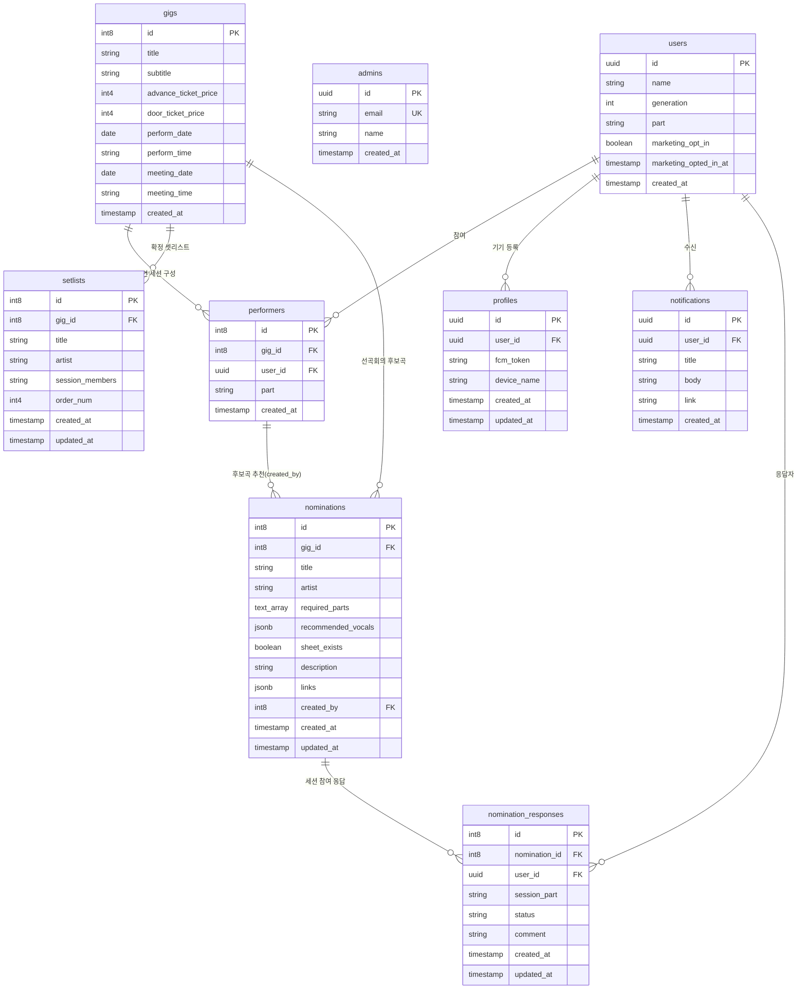

# 데이터베이스 스키마 명세 (Database Schema Specification)

본 문서는 Supabase(PostgreSQL)에 구축된 SOKNA 애플리케이션의 데이터 모델, 테이블 구조, 외래키 관계 및 인덱스/RLS 정책을 정의합니다.

---

## 1. 개체 관계도 (Entity Relationship Diagram)

---

## 2. 테이블 상세 명세 (Table Specifications)

### 2.1 `users` (회원 정보)
동아리 회원의 기본 인적사항, 가입 승인 상태 및 활동 정보를 관리합니다.

| 컬럼명 | 데이터 타입 | Nullable | 기본값 | 설명 |
| :--- | :--- | :--- | :--- | :--- |
| `id` | `uuid` | NO | - | 회원 고유 ID (Supabase auth.users.id 매핑) |
| `name` | `text` | NO | - | 회원 이름 (실명) |
| `generation` | `int4` | YES | null | 동아리 기수 (예: 39) |
| `part` | `text` | YES | null | 주 활동 파트 (보컬, 기타, 베이스, 드럼, 건반, 창작 등) |
| `email` | `text` | YES | null | 회원 이메일 주소 |
| `status` | `text` | NO | `'pending'` | 회원 승인 상태 (`'pending'`, `'approved'`, `'rejected'`) |
| `applied_at` | `timestamptz` | NO | `now()` | 가입 신청 일시 |
| `approved_at` | `timestamptz` | YES | null | 관리자 승인 일시 |
| `marketing_opt_in` | `bool` | NO | `false` | 웹 푸시/행사 소식 수신 선택 동의 여부 |
| `marketing_opted_in_at` | `timestamptz` | YES | null | 마지막으로 수신 동의가 `false`에서 `true`로 바뀐 시각. 기존 동의자는 과거 시각을 확인할 수 없어 null 유지 |
| `created_at` | `timestamptz` | NO | `now()` | 레코드 생성 일시 |

> `users_track_marketing_opted_in_at` 트리거가 가입 시 동의, 프로필 저장, 기기 알림 동의 다이얼로그의 동의 전환을 서버 시각으로 기록합니다. 동의 철회 시 null로 지우고, 동의 상태가 변하지 않는 회원 정보 수정에서는 기존 시각을 유지합니다. 새 컬럼을 직접 쓰더라도 트리거가 값을 덮어씁니다. 마이그레이션 이전에 이미 동의한 회원의 시각은 소급 추정하지 않습니다.

### 2.2 `admins` (관리자 목록)
공연 생성, 공지 발송 등 관리자 권한을 부여받은 사용자 목록입니다.

| 컬럼명 | 데이터 타입 | Nullable | 기본값 | 설명 |
| :--- | :--- | :--- | :--- | :--- |
| `id` | `uuid` | NO | - | 관리자 레코드 ID |
| `email` | `text` | NO | - | 관리자 이메일 (Unique) |
| `name` | `text` | YES | null | 관리자 이름 |
| `created_at` | `timestamptz` | NO | `now()` | 생성 일시 |

### 2.3 `gigs` (공연 정보)
정기 공연, 버스킹, 축제 등 각 공연 이벤트를 정의합니다.

| 컬럼명 | 데이터 타입 | Nullable | 기본값 | 설명 |
| :--- | :--- | :--- | :--- | :--- |
| `id` | `int8` (Identity) | NO | 자동증가 | 공연 고유 식별자 |
| `title` | `text` | YES | null | 공연 명칭 (예: 2026 봄 정기공연) |
| `subtitle` | `text` | YES | null | 공연 부제목 (예: SOKNA LIVE CONCERT, 메인 제목 아래 표시되는 테마/슬로건) |
| `advance_ticket_price` | `int4` | YES | null | 사전예매 티켓 가격 (KRW, 정수) |
| `door_ticket_price` | `int4` | YES | null | 현장예매 티켓 가격 (KRW, 정수) |
| `perform_date` | `date` | NO | - | 공연 일자 (YYYY-MM-DD) |
| `perform_time` | `text` | YES | null | 공연 시작 시각 (24시간제 HH:mm, 예: 19:00) |
| `meeting_date` | `date` | YES | null | 곡 선정 및 준비 총회(선곡회의) 일자 (YYYY-MM-DD) |
| `meeting_time` | `text` | YES | null | 선곡회의 시작 시각 (24시간제 HH:mm, 예: 14:00) |
| `location` | `text` | YES | null | 공연 장소 (예: 한양대학교 학생회관 콘서트홀) |
| `meeting_location` | `text` | YES | null | 선곡회의 장소 (예: 동아리방, 학생회관 301호 등) |
| `poster_url` | `text` | YES | null | 공연 공식 포스터 이미지 공개 URL (Supabase Storage: gigs/posters) |
| `is_public` | `bool` | NO | `true` | 공연 공개 여부 (`true`: 전체 공개, `false`: 관리자 및 해당 공연 참여자 전용) |
| `created_at` | `timestamptz` | NO | `now()` | 생성 일시 |

### 2.4 `gig_rsvps` (공연 참가 신청/수요 조사)
동아리 회원이 참가 신청 링크(`/gigs/:id/join`)를 통해 제출한 공연 참가 여부 및 희망 파트 응답입니다.

| 컬럼명 | 데이터 타입 | Nullable | 기본값 | 설명 및 관계 |
| :--- | :--- | :--- | :--- | :--- |
| `id` | `int8` (Identity) | NO | 자동증가 | 참가 신청 고유 식별자 |
| `gig_id` | `int8` | NO | - | FK → `gigs(id)` (ON DELETE CASCADE) |
| `user_id` | `uuid` | NO | - | FK → `users(id)` (ON DELETE CASCADE) |
| `status` | `text` | NO | - | 참여 상태 (`'going'`, `'not_going'`, `'undecided'`) |
| `part` | `text` | YES | null | 참여 시 희망 세션 파트 (예: 보컬, 베이스 등) |
| `note` | `text` | YES | null | 전달 사항 및 특이사항 메모 |
| `created_at` | `timestamptz` | NO | `now()` | 등록 일시 |
| `updated_at` | `timestamptz` | NO | `now()` | 수정 일시 |

> **Unique 제약조건**: `UNIQUE(gig_id, user_id)` (공연별 회원당 1개의 RSVP 레코드 유지)

> **참여 승인 처리** (`20260926000000_review_gig_rsvps.sql`):
> - `going`은 참여 신청이며, 승인 여부는 같은 `(gig_id, user_id)`의 `performers` 존재로 판단합니다. 승인된 RSVP는 보존하고 관리자 대기 목록에서는 제외합니다.
> - `review_gig_rsvp(p_gig_id bigint, p_rsvp_id bigint, p_updated_at timestamptz, p_decision text)`는 `approve` 시 신청 세션 그대로 공연자를 INSERT, `ignore` 시 RSVP를 DELETE합니다. 무시는 재신청 가능한 미선택 상태로 돌아갑니다.
> - `SECURITY DEFINER`, 빈 `search_path`, 명시적 스키마 참조 및 `auth.uid()`/`is_admin()` 권한 검사. PUBLIC 실행 권한을 회수하고, `20260926001000_restrict_gig_rsvp_rpc.sql`로 Supabase 기본 권한에 포함될 수 있는 `anon`의 직접 실행 권한도 회수합니다. 사용자 역할 중 authenticated만 실행 가능하며 관리자 여부는 함수 내부에서 다시 검사합니다.
> - `FOR UPDATE`로 신청을 잠그고 `updated_at`을 비교합니다. 이미 공연자이거나 신청이 없거나 변경되었거나 `going`이 아니면 `false`를 반환하며 데이터를 변경하지 않습니다. 세션이 없는 신청은 승인할 수 없습니다.
> - RSVP SELECT RLS는 본인 또는 `public.is_admin()`으로 관리자 전체 조회를 허용합니다. 다른 회원은 타인의 신청/비고를 읽을 수 없습니다.
> - 기존 컬럼 및 INSERT/UPDATE/DELETE RLS는 유지합니다. `submitGigRsvp`는 실제 공연자의 재제출과 접근 권한 없는 비공개 공연 신청을 서버에서 거부합니다.
> - 2026-09-26 운영 DB 적용 및 마이그레이션 이력 기록 완료. 기존 신청/공연자 레코드는 변경하지 않았습니다.

### 2.5 `performers` (공연 참여자 매핑)
공연(`gigs`)에 참가하는 회원(`users`)과 해당 공연에서의 담당 파트를 지정하는 매핑 테이블입니다. (가입 회원이 없는 미연동 더미 공연자도 보존 지원)

| 컬럼명 | 데이터 타입 | Nullable | 기본값 | 설명 및 관계 |
| :--- | :--- | :--- | :--- | :--- |
| `id` | `int8` (Identity) | NO | 자동증가 | 참여자 매핑 고유 식별자 |
| `gig_id` | `int8` | NO | - | FK → `gigs(id)` (ON DELETE CASCADE) |
| `user_id` | `uuid` | YES | null | FK → `users(id)` (미연동 더미 공연자는 null) |
| `name` | `text` | YES | null | 공연자 이름 (미연동 더미 공연자 저장 및 표기용) |
| `part` | `text` | NO | `'세션'` | 해당 공연에서의 배정 파트(다중 파트는 콤마 구분) |
| `photo_url` | `text` | YES | null | 공연별 세션 프로필 사진 URL (Supabase Storage: gigs/performers) |
| `created_at` | `timestamptz` | NO | `now()` | 생성 일시 |

### 2.6 `nominations` (선곡회의 후보곡 및 추천곡)
선곡 회의에서 참여 세션원들이 추천하고 조율하는 후보곡 목록입니다.

| 컬럼명 | 데이터 타입 | Nullable | 기본값 | 설명 및 관계 |
| :--- | :--- | :--- | :--- | :--- |
| `id` | `int8` (Identity) | NO | 자동증가 | 후보곡 고유 식별자 |
| `gig_id` | `int8` | NO | - | FK → `gigs(id)` (ON DELETE CASCADE) |
| `title` | `text` | NO | - | 곡 제목 |
| `artist` | `text` | YES | null | 원곡 아티스트 |
| `required_parts`| `text[]` | YES | `'{}'` | 필요 세션 파트 목록 (예: `['보컬(남)', '기타', '베이스']`) |
| `recommended_vocals` | `jsonb` | YES | `'[]'` | 선곡 회의 후보곡 추천 보컬 목록 (`[{ id: number, name: string, generation?: number, part?: string }]`) |
| `sheet_exists` | `bool` | YES | `false` | 악보 보유 여부 |
| `sheet_note` | `text` | YES | `''` | 악보 관련 추가 메모 (보유 파트, 키 정보, 악보 링크 등) |
| `description` | `text` | YES | `''` | 추천 사유 및 어필 메모 |
| `links` | `jsonb` | YES | `'[]'` | 참고 링크 목록 (`[{ url: string, note?: string, timestamp?: string, timestamps?: [{ id?: string, time: string, label: string }] }]`) |
| `created_by` | `int8` | YES | null | FK → `performers(id)` (ON DELETE SET NULL) |
| `created_at` | `timestamptz` | NO | `now()` | 등록 일시 |
| `updated_at` | `timestamptz` | NO | `now()` | 수정 일시 |

> **RLS 정책 (Row Level Security)**:
> - `SELECT`: 모든 사용자 조회 허용 (`USING (true)`)
> - `INSERT`: 해당 공연 참여자(`performers.gig_id = gig_id AND user_id = auth.uid()`) 또는 관리자(`is_admin()`)
> - `UPDATE`: 해당 곡 등록자(`created_by = performers.id AND user_id = auth.uid()`) 또는 관리자(`is_admin()`)
> - `DELETE`: 해당 곡 등록자(`created_by = performers.id AND user_id = auth.uid()`) 또는 관리자(`is_admin()`)

### 2.7 `setlists` (공연 확정 셋리스트)
공연 정보 페이지에 표시되는 최종 확정 연주 곡 및 세션 명단, 연주 순서입니다. (관리자만 등록/수정/삭제 가능)

| 컬럼명 | 데이터 타입 | Nullable | 기본값 | 설명 및 관계 |
| :--- | :--- | :--- | :--- | :--- |
| `id` | `int8` (Identity) | NO | 자동증가 | 곡 고유 식별자 |
| `gig_id` | `int8` | NO | - | FK → `gigs(id)` |
| `title` | `text` | YES | null | 곡 제목 |
| `artist` | `text` | YES | null | 원곡 아티스트 |
| `order_num` | `int4` | NO | `0` | 셋리스트 연주 순서 (1, 2, 3...) |
| `session_members` | `text` | YES | null | 가변 세션 슬롯 JSON 문자열 |
| `created_at` | `timestamptz` | NO | `now()` | 등록 일시 |
| `updated_at` | `timestamptz` | NO | `now()` | 수정 일시 |

### 2.8 `setlist_views` (선곡회의 확인 시점 기록)
사용자별 각 공연 선곡회의 마지막 확인 시점을 기록하여 변경 사항 하이라이팅의 기준점으로 활용합니다.

| 컬럼명 | 데이터 타입 | Nullable | 기본값 | 설명 및 관계 |
| :--- | :--- | :--- | :--- | :--- |
| `user_id` | `uuid` | NO | - | FK → `users(id)` (ON DELETE CASCADE) |
| `gig_id` | `int8` | NO | - | FK → `gigs(id)` (ON DELETE CASCADE) |
| `last_viewed_at` | `timestamptz` | NO | `now()` | 마지막 확인 일시 |

> **기본키**: `PRIMARY KEY (user_id, gig_id)`  
> **RLS**: 본인(`auth.uid() = user_id`)만 조회/등록/수정 가능

### 2.9 `gig_notification_queue` (새 곡 즉시 알림 대기열)
새 후보곡 등록 이벤트를 기록하고 중복 처리를 방지하며, 등록 요청 안에서 즉시 알림을 발송하기 위한 대기열입니다. 현재 기존 15분 디바운스는 비활성화되어 `scheduled_at = now()`를 사용합니다.

| 컬럼명 | 데이터 타입 | Nullable | 기본값 | 설명 및 관계 |
| :--- | :--- | :--- | :--- | :--- |
| `id` | `int8` (Identity) | NO | 자동증가 | 대기열 고유 식별자 |
| `gig_id` | `int8` | NO | - | FK → `gigs(id)` (ON DELETE CASCADE) |
| `triggered_by` | `uuid` | YES | null | FK → `users(id)` (등록자 제외용) |
| `song_ids` | `int8[]` | NO | `'{}'` | 누적 등록된 후보곡 ID 배열 |
| `scheduled_at` | `timestamptz` | NO | - | 알림 처리 가능 일시 (현재 즉시 처리를 위해 생성 시각과 동일) |
| `status` | `text` | NO | `'pending'` | 상태 (`'pending'`, `'processing'`, `'sent'`, `'cancelled'`) |
| `created_at` | `timestamptz` | NO | `now()` | 큐 생성 일시 |
| `sent_at` | `timestamptz` | YES | null | 발송 완료 일시 |

### 2.10 `nomination_responses` (선곡회의 세션 참여 응답 및 메모)
공연 참여자들이 각 후보곡에 대해 본인의 연주/보컬 참여 가능 여부와 관련 메모를 세션별로 기록하는 테이블입니다.

| 컬럼명 | 데이터 타입 | Nullable | 기본값 | 설명 및 관계 |
| :--- | :--- | :--- | :--- | :--- |
| `id` | `int8` (Identity) | NO | 자동증가 | 응답 고유 식별자 (PK) |
| `nomination_id` | `int8` | NO | - | FK → `nominations(id)` (ON DELETE CASCADE) |
| `user_id` | `uuid` | NO | - | FK → `users(id)` (ON DELETE CASCADE) |
| `session_part` | `text` | NO | `''` | 응답 대상 세션 파트 (예: `'보컬'`, `'기타'`, `'아코디언'` 등) |
| `status` | `text` | NO | `'undecided'` | 참여 가능 여부 (`'available'`, `'undecided'`, `'unavailable'`) |
| `comment` | `text` | NO | `''` | 참여 관련 메모 (선택 입력) |
| `created_at` | `timestamptz` | NO | `now()` | 생성 일시 |
| `updated_at` | `timestamptz` | NO | `now()` | 수정 일시 |

> **고유 제약**: `UNIQUE (nomination_id, user_id, session_part)` (후보곡 세션별 1인 1상태 보장)  
> **RLS**:
> - SELECT: 인증된 사용자(`auth.role() = 'authenticated'`) 조회 허용
> - INSERT / UPDATE / DELETE: 본인(`auth.uid() = user_id`)만 가능

### 2.7 `profiles` (기기 및 푸시 토큰)
사용자별 기기 정보 및 Firebase FCM 토큰을 저장합니다.

| 컬럼명 | 데이터 타입 | Nullable | 기본값 | 설명 |
| :--- | :--- | :--- | :--- | :--- |
| `id` | `uuid` | NO | - | 프로필 식별자 |
| `user_id` | `uuid` | YES | null | FK → `users(id)` |
| `fcm_token` | `text` | NO | - | 웹 푸시용 FCM 토큰 |
| `device_name` | `text` | YES | null | 접속 브라우저/기기 명칭 |
| `created_at` | `timestamptz` | NO | `now()` | 생성 일시 |
| `updated_at` | `timestamptz` | NO | `now()` | 수정 일시 |

### 2.7 `notifications` (인앱 알림 로그)
회원에게 전달된 알림 내역입니다.

| 컬럼명 | 데이터 타입 | Nullable | 기본값 | 설명 |
| :--- | :--- | :--- | :--- | :--- |
| `id` | `uuid` | NO | - | 알림 식별자 |
| `user_id` | `uuid` | YES | null | FK → `users(id)` (수신 대상, 사용자 삭제 시 `ON DELETE SET NULL`) |
| `title` | `text` | YES | null | 알림 제목 |
| `body` | `text` | YES | null | 알림 내용 |
| `link` | `text` | YES | null | 클릭 시 이동할 URL 경로 |
| `created_at` | `timestamptz` | NO | `now()` | 발송 일시 |
| `push_eligible` | `bool` | NO | `false` | FCM 푸시 발송 대상 이벤트 여부 |
| `push_status` | `text` | NO | `'pending'` | `pending`, `processing`, `sent`, `skipped`, `failed` |
| `push_attempted_at` | `timestamptz` | YES | null | 마지막 발송 시도 시각 |
| `push_sent_at` | `timestamptz` | YES | null | FCM 발송 성공 시각 |
| `push_error` | `text` | YES | null | 미발송 또는 실패 사유 |

> **푸시 수신 제한**: 실제 FCM 발송 직전 `users.marketing_opt_in = true`를 서버에서 재검증합니다. `profiles.fcm_token`은 전역 고유하며 사용자는 본인의 토큰만 조회/등록/삭제할 수 있습니다.

> **사용자 삭제**: `notifications` 로그는 보존하되 사용자 삭제를 막지 않도록, `users` 레코드가 삭제되면 해당 알림의 `user_id`만 외래키 `ON DELETE SET NULL`로 해제됩니다.

회원 승인에는 `approve_member_with_notification(p_user_id uuid)` DB 함수를 사용합니다. 이 함수는 관리자 권한을 확인하고 `pending → approved` 상태 변경과 승인 완료 푸시 outbox 생성을 단일 트랜잭션으로 처리하며, 이미 처리된 사용자는 `false`를 반환합니다.

### 2.8 `photos` (갤러리 사진첩)
동아리 정기 공연 및 연습 활동 사진을 관리합니다.

| 컬럼명 | 데이터 타입 | Nullable | 기본값 | 설명 |
| :--- | :--- | :--- | :--- | :--- |
| `id` | `uuid` | NO | `gen_random_uuid()` | 사진 고유 식별자 |
| `url` | `text` | NO | - | 이미지 URL |
| `title` | `text` | NO | - | 사진 제목 |
| `caption` | `text` | YES | null | 사진 설명 및 캡션 |
| `created_at` | `timestamptz` | NO | `now()` | 등록 일시 |
---

## 3. 데이터 무결성 및 RLS 원칙
1. **셋리스트 등록 권한**:
   - `setlists.created_by`는 반드시 해당 공연의 참여자로 등록된 `performers.id`여야 합니다.
2. **삭제 및 수정 제어**:
   - 본인이 생성한 곡이거나 관리자(`is_admin()`)인 경우에만 수정/삭제가 허용되도록 RLS 또는 Server Action 레벨에서 검증합니다.
3. **타입 생성 자동화**:
   - DB 스키마 변경 시 즉시 `npm run types`를 실행하여 `lib/supabase/database.types.ts`를 동기화해야 합니다.
