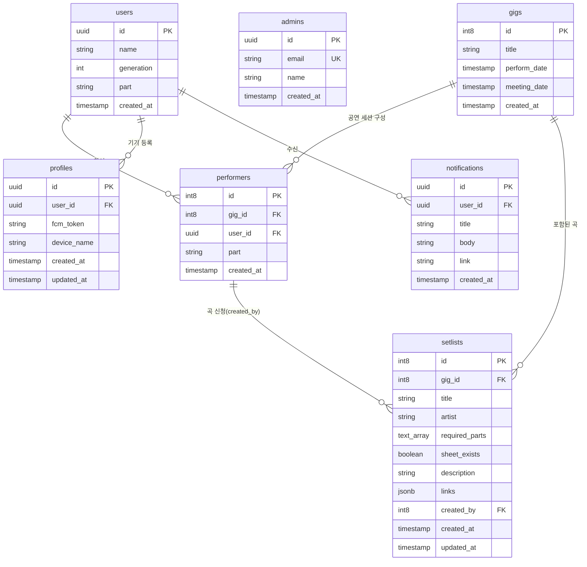

# 데이터베이스 스키마 명세 (Database Schema Specification)

본 문서는 Supabase(PostgreSQL)에 구축된 SOKNA 애플리케이션의 데이터 모델, 테이블 구조, 외래키 관계 및 인덱스/RLS 정책을 정의합니다.

---

## 1. 개체 관계도 (Entity Relationship Diagram)

---

## 2. 테이블 상세 명세 (Table Specifications)

### 2.1 `users` (회원 정보)
동아리 회원의 기본 인적사항 및 활동 정보를 관리합니다.

| 컬럼명 | 데이터 타입 | Nullable | 기본값 | 설명 |
| :--- | :--- | :--- | :--- | :--- |
| `id` | `uuid` | NO | - | 회원 고유 ID (Supabase auth.users.id 매핑) |
| `name` | `text` | NO | - | 회원 이름 (실명) |
| `generation` | `int4` | YES | null | 동아리 기수 (예: 24) |
| `part` | `text` | YES | null | 주 활동 파트 (보컬, 기타, 베이스, 드럼, 건반 등) |
| `created_at` | `timestamptz` | NO | `now()` | 생성 일시 |

### 2.2 `admins` (관리자 목록)
공연 생성, 공지 발송 등 관리자 권한을 부여받은 사용자 목록입니다.

| 컬럼명 | 데이터 타입 | Nullable | 기본값 | 설명 |
| :--- | :--- | :--- | :--- | :--- |
| `id` | `uuid` | NO | - | 관리자 레코드 ID |
| `email` | `text` | NO | - | 관리자 이메일 (Unique) |
| `name` | `text` | YES | null | 관리자 이름 |
| `created_at` | `timestamptz` | NO | `now()` | 생성 일시 |

### 2.3 `gigs` (공연 정보)
정기 공연, 버스킹, 축제 등 각 공연 이벤트를 정의합니다.

| 컬럼명 | 데이터 타입 | Nullable | 기본값 | 설명 |
| :--- | :--- | :--- | :--- | :--- |
| `id` | `int8` (Identity) | NO | 자동증가 | 공연 고유 식별자 |
| `title` | `text` | YES | null | 공연 명칭 (예: 2026 봄 정기공연) |
| `perform_date` | `timestamptz` | NO | - | 공연 일시 |
| `meeting_date` | `timestamptz` | YES | null | 곡 선정 및 준비 총회 일시 |
| `created_at` | `timestamptz` | NO | `now()` | 생성 일시 |

### 2.4 `performers` (공연 참여자 매핑)
공연(`gigs`)에 참가하는 회원(`users`)과 해당 공연에서의 담당 파트를 지정하는 매핑 테이블입니다.

| 컬럼명 | 데이터 타입 | Nullable | 기본값 | 설명 및 관계 |
| :--- | :--- | :--- | :--- | :--- |
| `id` | `int8` (Identity) | NO | 자동증가 | 참여자 매핑 고유 식별자 |
| `gig_id` | `int8` | NO | - | FK → `gigs(id)` (ON DELETE CASCADE) |
| `user_id` | `uuid` | NO | - | FK → `users(id)` |
| `part` | `text` | NO | - | 해당 공연에서의 배정 파트 |
| `created_at` | `timestamptz` | NO | `now()` | 생성 일시 |

### 2.5 `setlists` (셋리스트 및 곡 정보)
각 공연에 등록된 연주 곡 및 요구 세션, 악보 정보입니다.

| 컬럼명 | 데이터 타입 | Nullable | 기본값 | 설명 및 관계 |
| :--- | :--- | :--- | :--- | :--- |
| `id` | `int8` (Identity) | NO | 자동증가 | 곡 고유 식별자 |
| `gig_id` | `int8` | NO | - | FK → `gigs(id)` |
| `title` | `text` | YES | null | 곡 제목 |
| `artist` | `text` | YES | null | 원곡 아티스트 |
| `required_parts`| `text[]` | YES | null | 필요 세션 파트 목록 (예: `['보컬', '기타', '베이스']`) |
| `sheet_exists` | `bool` | YES | `false` | 악보 보유 여부 |
| `description` | `text` | YES | null | 곡 관련 추가 설명 및 요청사항 |
| `links` | `jsonb` | YES | `[]` | 참고 링크 목록 (`[{ url: string, note?: string }]`) |
| `created_by` | `int8` | YES | null | FK → `performers(id)` (곡 신청 세션원) |
| `created_at` | `timestamptz` | NO | `now()` | 등록 일시 |
| `updated_at` | `timestamptz` | NO | `now()` | 수정 일시 |

### 2.6 `profiles` (기기 및 푸시 토큰)
사용자별 기기 정보 및 Firebase FCM 토큰을 저장합니다.

| 컬럼명 | 데이터 타입 | Nullable | 기본값 | 설명 |
| :--- | :--- | :--- | :--- | :--- |
| `id` | `uuid` | NO | - | 프로필 식별자 |
| `user_id` | `uuid` | YES | null | FK → `users(id)` |
| `fcm_token` | `text` | NO | - | 웹 푸시용 FCM 토큰 |
| `device_name` | `text` | YES | null | 접속 브라우저/기기 명칭 |
| `created_at` | `timestamptz` | NO | `now()` | 생성 일시 |
| `updated_at` | `timestamptz` | NO | `now()` | 수정 일시 |

### 2.7 `notifications` (인앱 알림 로그)
회원에게 전달된 알림 내역입니다.

| 컬럼명 | 데이터 타입 | Nullable | 기본값 | 설명 |
| :--- | :--- | :--- | :--- | :--- |
| `id` | `uuid` | NO | - | 알림 식별자 |
| `user_id` | `uuid` | YES | null | FK → `users(id)` (수신 대상) |
| `title` | `text` | YES | null | 알림 제목 |
| `body` | `text` | YES | null | 알림 내용 |
| `link` | `text` | YES | null | 클릭 시 이동할 URL 경로 |
| `created_at` | `timestamptz` | NO | `now()` | 발송 일시 |

### 2.8 `photos` (갤러리 사진첩)
동아리 정기 공연 및 연습 활동 사진을 관리합니다.

| 컬럼명 | 데이터 타입 | Nullable | 기본값 | 설명 |
| :--- | :--- | :--- | :--- | :--- |
| `id` | `uuid` | NO | `gen_random_uuid()` | 사진 고유 식별자 |
| `url` | `text` | NO | - | 이미지 URL |
| `title` | `text` | NO | - | 사진 제목 |
| `caption` | `text` | YES | null | 사진 설명 및 캡션 |
| `created_at` | `timestamptz` | NO | `now()` | 등록 일시 |

### 2.9 `gig_attendees` (공연 동문/회원 참석 신청 현황)
40주년 기념 공연 등 특정 공연의 동문 및 회원 참석 여부(RSVP) 설문 응답입니다.

| 컬럼명 | 데이터 타입 | Nullable | 기본값 | 설명 |
| :--- | :--- | :--- | :--- | :--- |
| `id` | `int8` (Identity) | NO | 자동증가 | 응답 식별자 |
| `gig_id` | `int8` | NO | - | FK → `gigs(id)` |
| `name` | `text` | NO | - | 참석자 성함 |
| `generation` | `int4` | YES | null | 동아리 기수 |
| `part` | `text` | YES | null | 활동 파트 |
| `phone` | `text` | YES | null | 연락처 |
| `attendance_status` | `text` | NO | `'attending'` | 참석 상태 (`attending`, `declined`, `uncertain`) |
| `guests_count` | `int4` | NO | `0` | 동반 인원수 |
| `memo` | `text` | YES | null | 남기실 말씀 및 응원 메시지 |
| `created_at` | `timestamptz` | NO | `now()` | 제출 일시 |

---

## 3. 데이터 무결성 및 RLS 원칙
1. **셋리스트 등록 권한**:
   - `setlists.created_by`는 반드시 해당 공연의 참여자로 등록된 `performers.id`여야 합니다.
2. **삭제 및 수정 제어**:
   - 본인이 생성한 곡이거나 관리자(`is_admin()`)인 경우에만 수정/삭제가 허용되도록 RLS 또는 Server Action 레벨에서 검증합니다.
3. **타입 생성 자동화**:
   - DB 스키마 변경 시 즉시 `npm run types`를 실행하여 `lib/supabase/database.types.ts`를 동기화해야 합니다.
