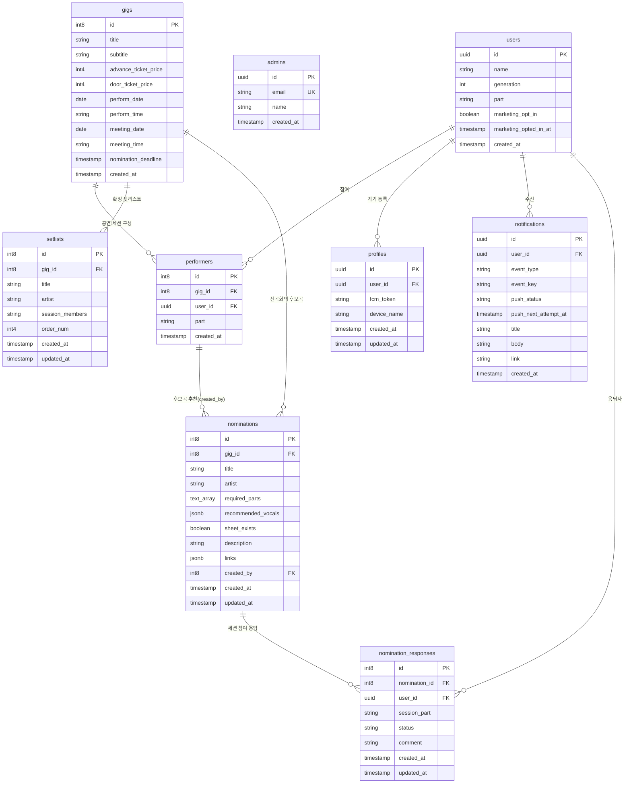

# 데이터베이스 스키마 명세 (Database Schema Specification)

본 문서는 Supabase(PostgreSQL)에 구축된 SOKNA 애플리케이션의 데이터 모델, 테이블 구조, 외래키 관계 및 인덱스/RLS 정책을 정의합니다.

---

## 1. 개체 관계도 (Entity Relationship Diagram)

```mermaid
erDiagram
    users ||--o{ performers : "참여"
    users ||--o{ profiles : "기기 등록"
    users ||--o{ notifications : "수신"
    admins {
        uuid id PK
        string email UK
        string name
        timestamp created_at
    }
    users {
        uuid id PK
        string name
        int generation
        string part
        boolean marketing_opt_in
        timestamp marketing_opted_in_at
        timestamp created_at
    }
    gigs ||--o{ performers : "공연 세션 구성"
    gigs ||--o{ setlists : "확정 셋리스트"
    gigs ||--o{ nominations : "선곡회의 후보곡"
    gigs {
        int8 id PK
        string title
        string subtitle
        int4 advance_ticket_price
        int4 door_ticket_price
        date perform_date
        string perform_time
        date meeting_date
        string meeting_time
        timestamp nomination_deadline
        timestamp created_at
    }
    performers ||--o{ nominations : "후보곡 추천(created_by)"
    performers {
        int8 id PK
        int8 gig_id FK
        uuid user_id FK
        string part
        timestamp created_at
    }
    setlists {
        int8 id PK
        int8 gig_id FK
        string title
        string artist
        string session_members
        int4 order_num
        timestamp created_at
        timestamp updated_at
    }
    nominations ||--o{ nomination_responses : "세션 참여 응답"
    users ||--o{ nomination_responses : "응답자"
    nominations {
        int8 id PK
        int8 gig_id FK
        string title
        string artist
        text_array required_parts
        jsonb recommended_vocals
        boolean sheet_exists
        string description
        jsonb links
        int8 created_by FK
        timestamp created_at
        timestamp updated_at
    }
    nomination_responses {
        int8 id PK
        int8 nomination_id FK
        uuid user_id FK
        string session_part
        string status
        string comment
        timestamp created_at
        timestamp updated_at
    }
    profiles {
        uuid id PK
        uuid user_id FK
        string fcm_token
        string device_name
        timestamp created_at
        timestamp updated_at
    }
    notifications {
        uuid id PK
        uuid user_id FK
        string event_type
        string event_key
        string push_status
        timestamp push_next_attempt_at
        string title
        string body
        string link
        timestamp created_at
    }
```

---

## 2. 테이블 상세 명세 (Table Specifications)

### 2.1 `users` (회원 정보)
동아리 회원의 기본 인적사항, 가입 승인 상태 및 활동 정보를 관리합니다.

| 컬럼명 | 데이터 타입 | Nullable | 기본값 | 설명 |
| :--- | :--- | :--- | :--- | :--- |
| `id` | `uuid` | NO | - | 회원 고유 ID (Supabase auth.users.id 매핑) |
| `name` | `text` | NO | - | 회원 이름 (실명) |
| `generation` | `int4` | YES | null | 동아리 기수 (예: 39) |
| `part` | `text` | YES | null | 주 활동 파트 (보컬, 기타, 베이스, 드럼, 건반, 창작 등) |
| `email` | `text` | YES | null | 회원 이메일 주소 |
| `status` | `text` | NO | `'pending'` | 회원 승인 상태 (`'pending'`, `'approved'`, `'rejected'`) |
| `applied_at` | `timestamptz` | NO | `now()` | 가입 신청 일시 |
| `approved_at` | `timestamptz` | YES | null | 관리자 승인 일시 |
| `marketing_opt_in` | `bool` | NO | `false` | 웹 푸시/행사 소식 수신 선택 동의 여부 |
| `marketing_opted_in_at` | `timestamptz` | YES | null | 마지막으로 수신 동의가 `false`에서 `true`로 바뀐 시각. 기존 동의자는 과거 시각을 확인할 수 없어 null 유지 |
| `created_at` | `timestamptz` | NO | `now()` | 레코드 생성 일시 |

> `users_protect_member_approval` 트리거는 일반 API 사용자의 자가 승인과 승인 시각 변경을 차단합니다. 본인 신규 프로필은 `pending`·`approved_at = null`만 가능하며, 상태 변경은 반려 후 재신청(`rejected → pending`)만 허용합니다. 일반 프로필 수정과 관리자 승인/반려, 신뢰된 Auth·관리자 전용 함수의 변경은 유지합니다.

> `users_track_marketing_opted_in_at` 트리거가 가입 시 동의, 프로필 저장, 기기 알림 동의 다이얼로그의 동의 전환을 서버 시각으로 기록합니다. 동의 철회 시 null로 지우고, 동의 상태가 변하지 않는 회원 정보 수정에서는 기존 시각을 유지합니다. 새 컬럼을 직접 쓰더라도 트리거가 값을 덮어씁니다. 마이그레이션 이전에 이미 동의한 회원의 시각은 소급 추정하지 않습니다.

> `20260927020000_unify_push_consent.sql`은 수신 동의가 true → false로 바뀐 뒤 본인 `profiles`를 삭제하는 `users_delete_push_profiles_on_opt_out` AFTER UPDATE 트리거를 추가합니다. 동의·동의 시각 변경과 모든 기기 삭제는 같은 트랜잭션이며, 삭제 실패 시 모두 롤백됩니다. `delete_push_profiles_on_opt_out()`은 고정 search_path의 SECURITY DEFINER로 실행하고 PUBLIC·anon·authenticated 직접 실행 권한을 허용하지 않습니다. users 갱신의 기존 RLS와 회원 승인 보호 규칙은 유지합니다. 같은 false 값 저장이나 미동의 계정으로의 기기 연결은 철회로 취급하지 않습니다. 신규 컬럼·공개 RPC·기존 데이터 보정은 없습니다. 2026-09-27 공유 운영 DB 적용과 기존 데이터 건수 보존을 확인했으며 `npm run types`의 공개 타입 내용은 동일합니다.

### 2.2 `admins` (관리자 목록)
공연 생성, 공지 발송 등 관리자 권한을 부여받은 사용자 목록입니다.

| 컬럼명 | 데이터 타입 | Nullable | 기본값 | 설명 |
| :--- | :--- | :--- | :--- | :--- |
| `id` | `uuid` | NO | - | 관리자 계정 ID (Supabase auth.users.id와 일치) |
| `email` | `text` | NO | - | 현재 계정 이메일 (Unique), 권한 판별은 id 사용 |
| `name` | `text` | YES | null | 관리자 이름 |
| `created_at` | `timestamptz` | NO | `now()` | 생성 일시 |

#### 로그인 수단 해제와 계정 이메일·관리자 권한

`20260927030000_manage_login_identities.sql`은 대표 Google identity 해제로 Auth 이메일이 바뀌어도 회원과 관리자 계정을 유지하기 위한 변경입니다.

- 적용 전 `auth.users`와 `public.admins`를 잠그고 모든 관리자 ID·이메일이 같은 Auth 계정과 일치하는지 확인합니다. 불일치·미연결 관리자 레코드가 있으면 적용을 중단합니다. 기존 권한이나 데이터를 임의로 병합·보정하지 않습니다. 마이그레이션 잠금 대기는 5초, 실행은 30초로 제한합니다.
- `is_admin()`은 `admins.id = auth.uid()`로 판별합니다. JWT 이메일 비교를 제거하여 이전 이메일을 다른 사용자가 소유하더라도 관리자 권한을 얻지 않습니다. `getIsAdmin()`과 관리자 명부 표시·중복 임명 확인·본인 권한 해제 차단도 같은 ID를 사용합니다.
- `auth_users_sync_member_email` AFTER UPDATE OF email 트리거는 실제 Auth 이메일이 달라진 경우에만 `sync_auth_user_email()`을 호출합니다. 동일 ID의 `public.users.email`과 `public.admins.email`을 Auth 변경과 같은 트랜잭션에서 갱신합니다. 이름·가입 상태·승인일·동의·활동 기록은 유지합니다. 관리자 이메일 고유 제약 충돌 등으로 실패하면 Auth 변경과 identity 해제도 함께 롤백됩니다.
- `20260927040000_support_kakao_identities.sql`은 앞선 마이그레이션을 수정하지 않고 기존 Google 보호 트리거·함수를 `auth_identities_protect_last_social`·`protect_last_social_identity()`로 교체합니다. 새 BEFORE DELETE 트리거는 Google·Kakao identity를 지울 때 부모 `auth.users` 행을 `FOR UPDATE`로 잠근 뒤 남은 사용 가능한 로그인 수단을 다시 검사합니다. 잠금 대기 5초·실행 30초 제한을 유지합니다.
- 대체 Google identity는 `email_verified`가 명시적인 JSON boolean false가 아닌 경우에 인정합니다. Kakao는 `email_verified`가 JSON boolean true이며 이메일이 문자열이고 JavaScript `trim()`과 같은 공백 제거 후 비어 있지 않아야 합니다. 이메일 identity는 명시적으로 검증되었거나 현재 Auth 이메일과 같고 `email_confirmed_at`이 있는 경우에 인정합니다. 서버의 해제 가능 조건과 일치시키며, 확인되지 않은 Kakao만 남는 Google 해제도 거절합니다.
- Kakao 조건은 운영 Auth `v2.197.0`의 [Kakao provider 구현](https://github.com/supabase/auth/blob/v2.197.0/internal/api/provider/kakao.go)을 기준으로 합니다. 이 버전은 Kakao의 `is_email_valid`와 `is_email_verified`가 모두 true일 때만 이메일을 검증된 것으로 기록합니다. 이메일 선택 동의를 지원하는 최신 가이드와 버전 동작을 혼동하지 않습니다.
- 이 잠금은 서로 다른 Google·Kakao identity의 동시 삭제를 계정별로 직렬화합니다. 이메일·전화번호 등 다른 provider의 직접 삭제는 이 트리거의 보호 범위가 아닙니다. 전체 계정 hard delete의 부모 없는 cascade 및 `deleted_at`이 있는 soft delete는 허용합니다. Google·Kakao 자동 연결에서 새 사용 가능한 identity 생성 후 미확인 identity를 삭제하는 흐름을 유지합니다.
- 두 내부 트리거 함수는 빈 `search_path`와 `SECURITY DEFINER`를 사용하며 `PUBLIC`·`anon`·`authenticated` 직접 실행 권한을 허용하지 않습니다. 이메일만 갱신하므로 신청 알림·수신 동의 관련 UPDATE OF 트리거는 실행되지 않습니다.
- 테이블 컬럼·외래키 추가나 기존 데이터 일괄 변경은 없습니다. 기존 `users.email`은 nullable이며 unique 제약이 없고, `admins.email`의 NOT NULL·UNIQUE 제약을 유지합니다.

격리 PostgreSQL 검증은 `tests/run-login-identities-sql.mjs`에서 두 마이그레이션을 순서대로 실행합니다. 총 18개 검증으로 Auth 역할의 이메일 승격과 RLS 우회 범위, 승인·관리자 보존, 이전 이메일 권한 차단, Google·Kakao 상호 대체, 마지막 Kakao 보호, 미검증·빈 이메일·Unicode 공백 Kakao 거절, Kakao 이메일 충돌 롤백, 자동 교체, soft delete·hard delete 및 기존 회원 탈퇴 RPC의 혼합 identity cascade, 레거시 관리자 preflight 거부를 확인했습니다. 단일 연결 PGlite이므로 두 독립 DB 세션의 실제 잠금 경합은 실행하지 않았습니다. `tests/admin-identity.test.mjs`에서 계정 ID 기반 서버 관리자 판별·중복 임명·본인 해제 차단 4개를 검증했습니다.

2026-09-27 연결된 SOKNA 운영 DB에는 `20260927030000_manage_login_identities.sql`을 적용하고 이력·트리거 활성화·함수 권한·빈 search_path를 재확인했습니다. 관리자 7명의 ID와 이메일 정합성은 모두 유지되었습니다. 당시 npm run types를 실행했으며 공개 타입 내용은 동일했습니다. `20260927040000_support_kakao_identities.sql`은 2026-09-27 운영 DB에 적용하고 마이그레이션 이력, 새 트리거 활성화와 이전 Google 트리거 제거, 빈 search_path, anon·authenticated 실행 권한 없음, 관리자 7명의 ID·이메일 정합성 보존을 재확인했습니다. 운영 코드 배포와 실제 Google·Kakao 계정 연결·해제 E2E는 확인하지 않았습니다.

### 2.3 `gigs` (공연 정보)
정기 공연, 버스킹, 축제 등 각 공연 이벤트를 정의합니다.

| 컬럼명 | 데이터 타입 | Nullable | 기본값 | 설명 |
| :--- | :--- | :--- | :--- | :--- |
| `id` | `int8` (Identity) | NO | 자동증가 | 공연 고유 식별자 |
| `title` | `text` | YES | null | 공연 명칭 (예: 2026 봄 정기공연) |
| `subtitle` | `text` | YES | null | 공연 부제목 (예: SOKNA LIVE CONCERT, 메인 제목 아래 표시되는 테마/슬로건) |
| `advance_ticket_price` | `int4` | YES | null | 사전예매 티켓 가격 (KRW, 정수) |
| `door_ticket_price` | `int4` | YES | null | 현장예매 티켓 가격 (KRW, 정수) |
| `perform_date` | `date` | NO | - | 공연 일자 (YYYY-MM-DD) |
| `perform_time` | `text` | YES | null | 공연 시작 시각 (24시간제 HH:mm, 예: 19:00) |
| `meeting_date` | `date` | YES | null | 곡 선정 및 준비 총회(선곡회의) 일자 (YYYY-MM-DD) |
| `meeting_time` | `text` | YES | null | 선곡회의 시작 시각 (24시간제 HH:mm, 예: 14:00) |
| `nomination_deadline` | `timestamptz` | YES | null | 추천곡 접수 마감 시각. null이면 마감 기한 없음 |
| `location` | `text` | YES | null | 공연 장소 (예: 한양대학교 학생회관 콘서트홀) |
| `meeting_location` | `text` | YES | null | 선곡회의 장소 (예: 동아리방, 학생회관 301호 등) |
| `poster_url` | `text` | YES | null | 공연 공식 포스터 이미지 공개 URL (Supabase Storage: gigs/posters) |
| `visibility` | `text` | NO | `'members'` | 공개 범위: `private`(관리자만), `members`(승인 완료 회원), `public`(모든 방문자), CHECK 제약 적용 |
| `is_public` | `bool` | NO | `false` | 호환용 전체 공개 여부. 트리거가 `visibility = 'public'`과 동기화 |
| `created_at` | `timestamptz` | NO | `now()` | 생성 일시 |

> `20260930000000_add_nomination_deadline_to_gigs.sql`은 2026-09-30 연결된 DB에 적용했습니다. 원격 마이그레이션 이력과 `npm run types` 재생성 결과에서 `gigs.nomination_deadline`(`timestamptz`, nullable)을 확인했습니다. 기존 공연의 값은 null이며 접수 마감이 없습니다.

> `20260926083828_add_gig_visibility_levels.sql`은 기존 `is_public=false`를 `members`, `true`를 `public`으로 전환합니다. `gigs` SELECT에는 공개 범위별 허용형·제한형 RLS를 적용하고, 관리자 관리 정책을 제공합니다. 공연자·확정 셋리스트·후보곡·응답의 SELECT에는 상위 공연 조회 권한을 추가로 검사합니다. 세부 규칙과 적용 순서는 [공연 공개 범위 명세](../features/gig-visibility.md)를 참고하십시오.

> `20260927010000_require_approved_gig_membership.sql`은 2026-09-27 공유 운영 DB에 적용했습니다. 회원 공개 조회를 `is_approved_member()`(`users.status = 'approved'`) 또는 관리자에게만 허용합니다. 기존 허용형·제한형 정책을 함께 강화하므로 공연 하위 테이블의 조회에도 동일하게 적용됩니다. 미신청·승인 대기·반려·프로필 누락 계정은 전체 공개만 조회합니다.

> 2026-09-26 운영 DB 적용 및 REST API 컬럼 인식 확인 완료. 기존 공연 4개의 공개 범위를 보존했고, 비로그인·회원·관리자 조회 권한을 검증했습니다.

### 2.4 `gig_rsvps` (공연 참가 신청/수요 조사)
동아리 회원이 참가 신청 링크(`/gigs/:id/join`)를 통해 제출한 공연 참가 여부 및 희망 파트 응답입니다.

| 컬럼명 | 데이터 타입 | Nullable | 기본값 | 설명 및 관계 |
| :--- | :--- | :--- | :--- | :--- |
| `id` | `int8` (Identity) | NO | 자동증가 | 참가 신청 고유 식별자 |
| `gig_id` | `int8` | NO | - | FK → `gigs(id)` (ON DELETE CASCADE) |
| `user_id` | `uuid` | NO | - | FK → `users(id)` (ON DELETE CASCADE) |
| `status` | `text` | NO | - | 참여 상태 (`'going'`, `'not_going'`, `'undecided'`) |
| `part` | `text` | YES | null | 참여 시 희망 세션 파트. 여러 세션은 쉼표와 공백으로 구분 (예: `기타, 드럼`) |
| `note` | `text` | YES | null | 전달 사항 및 특이사항 메모 |
| `review_status` | `text` | NO | `pending` | 관리자 검토 상태 (`pending`, `approved`, `rejected`). 참여 의사 `status`와 별개 |
| `reviewed_at` | `timestamptz` | YES | null | 마지막 승인/반려 시각. 마이그레이션 이전 승인 기록은 null |
| `reviewed_by` | `uuid` | YES | null | 마지막 처리 관리자 ID. 관리자 권한 회수 후에도 기록 보존 |
| `created_at` | `timestamptz` | NO | `now()` | 등록 일시 |
| `updated_at` | `timestamptz` | NO | `now()` | 수정 일시 |

> **Unique 제약조건**: `UNIQUE(gig_id, user_id)` (공연별 회원당 1개의 RSVP 레코드 유지)

> **기존 참여 신청 알림** (`20260930010000_notify_gig_rsvp_requested.sql`, 2026-09-30 운영 DB 적용 완료): 새 검토 상태 마이그레이션 적용 전에는 INSERT에서 `status = going`이거나 UPDATE로 불참·미정에서 `going`으로 전환될 때만 AFTER 트리거가 관리자별 `notifications`를 같은 트랜잭션에 생성합니다. 세션·메모만 재저장해도 중복 생성하지 않습니다. 이벤트 키는 RSVP ID와 해당 전환의 `updated_at` UTC 밀리초 시각을 결합하며, 재신청 시 새 전환을 구분합니다. 푸시 미동의 관리자도 인앱 알림은 받습니다.

> **참여 신청 검토** (`20260930020000_admin_console_reviews.sql`, 2026-09-30 운영 DB 적용 완료):
> - 참여 의사 `going`과 검토 결과를 분리합니다. `going + pending`이며 같은 공연의 공연자가 아닌 신청만 승인 대기 목록에 표시합니다. 기존 `going` RSVP 중 `performers`가 있는 건은 `approved`로 보정합니다.
> - `review_gig_rsvp(p_gig_id, p_rsvp_id, p_updated_at, p_decision)`은 관리자 권한과 신청 버전을 확인하고 행을 잠급니다. `approve`는 공연자를 등록하고 `approved`, `reject`는 RSVP를 보존하고 `rejected`로 기록합니다. 처리 관리자·시각을 함께 저장합니다. 이미 변경·처리된 요청은 false입니다.
> - 공연자를 수동 등록해도 연결된 대기 RSVP는 승인 기록으로 전환합니다. 공연자 명단에서 제거한 뒤 회원이 다시 신청을 저장하면 새 대기 상태로 복귀할 수 있습니다.
> - 일반 회원의 직접 승인·반려·처리 정보 변경 및 승인·반려 기록 삭제는 트리거와 RLS로 차단합니다. 반려된 회원의 참여 신청 재저장은 `pending`으로 전환되고 처리 정보가 초기화됩니다.
> - `notify_gig_rsvp_requested`는 처음 `going`이 되거나 반려 후 재신청될 때만 관리자 알림을 만듭니다. 대기 신청의 세션·비고 재저장이나 승인·반려 처리에는 중복 알림을 만들지 않습니다. 알림 링크는 `/admin/approvals`이며 기존 신청 알림 링크도 이 경로로 갱신합니다.
> - `SECURITY DEFINER` 검토 RPC와 알림 함수는 빈 `search_path`를 사용하고 비로그인 직접 실행 권한을 허용하지 않습니다. RSVP 조회 RLS는 본인 또는 관리자에게만 비고를 공개합니다.
> - 원격 마이그레이션 이력을 확인하고 `npm run types`로 공개 타입을 재생성했습니다.

### 2.5 `performers` (공연 참여자 매핑)
공연(`gigs`)에 참가하는 회원(`users`)과 해당 공연에서의 담당 파트를 지정하는 매핑 테이블입니다. (가입 회원이 없는 미연동 더미 공연자도 보존 지원)

| 컬럼명 | 데이터 타입 | Nullable | 기본값 | 설명 및 관계 |
| :--- | :--- | :--- | :--- | :--- |
| `id` | `int8` (Identity) | NO | 자동증가 | 참여자 매핑 고유 식별자 |
| `gig_id` | `int8` | NO | - | FK → `gigs(id)` (ON DELETE CASCADE) |
| `user_id` | `uuid` | YES | null | FK → `users(id)` (미연동 더미 공연자는 null) |
| `name` | `text` | YES | null | 공연자 이름 (미연동 더미 공연자 저장 및 표기용) |
| `part` | `text` | NO | `'세션'` | 해당 공연에서의 배정 파트(다중 파트는 콤마 구분) |
| `photo_url` | `text` | YES | null | 공연별 세션 프로필 사진 URL (Supabase Storage: gigs/performers) |

> **중복 방지**: `performers_gig_user_unique` 부분 고유 인덱스로 `user_id IS NOT NULL`인 행은 공연별 회원당 한 행만 허용합니다. 기존 중복 행은 파트·이름·사진 및 등록자 참조를 합쳐 정리합니다. 더미 공연자(`user_id = null`)는 동명이인을 허용합니다. 공연 세션의 표준 건반 명칭은 `건반`입니다.
> 2026-09-28 운영 DB에서 표준 건반 명칭으로 19개 저장 값을 정리하고, 동일 공연·회원 중복 2쌍을 병합했습니다. `nominations.created_by`와 `setlists.created_by`는 유지되는 행으로 이전했습니다.
| `created_at` | `timestamptz` | NO | `now()` | 생성 일시 |

### 2.6 `nominations` (선곡회의 후보곡 및 추천곡)
선곡 회의에서 참여 세션원들이 추천하고 조율하는 후보곡 목록입니다.

| 컬럼명 | 데이터 타입 | Nullable | 기본값 | 설명 및 관계 |
| :--- | :--- | :--- | :--- | :--- |
| `id` | `int8` (Identity) | NO | 자동증가 | 후보곡 고유 식별자 |
| `gig_id` | `int8` | NO | - | FK → `gigs(id)` (ON DELETE CASCADE) |
| `title` | `text` | NO | - | 곡 제목 |
| `artist` | `text` | YES | null | 원곡 아티스트 |
| `required_parts`| `text[]` | YES | `'{}'` | 필요 세션 파트 목록 (예: `['보컬(남)', '기타', '베이스']`) |
| `recommended_vocals` | `jsonb` | YES | `'[]'` | 선곡 회의 후보곡 추천 보컬 목록 (`[{ id: number, name: string, generation?: number, part?: string }]`) |
| `sheet_exists` | `bool` | YES | `false` | 악보 보유 여부 |
| `sheet_note` | `text` | YES | `''` | 악보 관련 추가 메모 (보유 파트, 키 정보, 악보 링크 등) |
| `description` | `text` | YES | `''` | 추천 사유 및 어필 메모 |
| `links` | `jsonb` | YES | `'[]'` | 참고 링크 목록 (`[{ url: string, note?: string, timestamp?: string, timestamps?: [{ id?: string, time: string, label: string }] }]`) |
| `created_by` | `int8` | YES | null | FK → `performers(id)` (ON DELETE SET NULL) |
| `created_at` | `timestamptz` | NO | `now()` | 등록 일시 |
| `updated_at` | `timestamptz` | NO | `now()` | 수정 일시 |

> **RLS 정책 (Row Level Security)**:
> - `SELECT`: 모든 사용자 조회 허용 (`USING (true)`)
> - `INSERT`: 해당 공연 참여자(`performers.gig_id = gig_id AND user_id = auth.uid()`) 또는 관리자(`is_admin()`)
> - `UPDATE`: 해당 곡 등록자(`created_by = performers.id AND user_id = auth.uid()`) 또는 관리자(`is_admin()`)
> - `DELETE`: 해당 곡 등록자(`created_by = performers.id AND user_id = auth.uid()`) 또는 관리자(`is_admin()`)

### 2.7 `setlists` (공연 확정 셋리스트)
공연 정보 페이지에 표시되는 최종 확정 연주 곡 및 세션 명단, 연주 순서입니다. (관리자만 등록/수정/삭제 가능)

| 컬럼명 | 데이터 타입 | Nullable | 기본값 | 설명 및 관계 |
| :--- | :--- | :--- | :--- | :--- |
| `id` | `int8` (Identity) | NO | 자동증가 | 곡 고유 식별자 |
| `gig_id` | `int8` | NO | - | FK → `gigs(id)` |
| `title` | `text` | YES | null | 곡 제목 |
| `artist` | `text` | YES | null | 원곡 아티스트 |
| `order_num` | `int4` | NO | `0` | 셋리스트 연주 순서 (1, 2, 3...) |
| `created_by` | `int8` | YES | null | FK → `performers(id)` (등록 공연자, 행 병합 시 이전) |
| `session_members` | `text` | YES | null | 가변 세션 슬롯 JSON 문자열 |
| `created_at` | `timestamptz` | NO | `now()` | 등록 일시 |
| `updated_at` | `timestamptz` | NO | `now()` | 수정 일시 |

### 2.8 `setlist_views` (선곡회의 확인 시점 기록)
사용자별 각 공연 선곡회의 마지막 확인 시점을 기록하여 변경 사항 하이라이팅의 기준점으로 활용합니다.

| 컬럼명 | 데이터 타입 | Nullable | 기본값 | 설명 및 관계 |
| :--- | :--- | :--- | :--- | :--- |
| `user_id` | `uuid` | NO | - | FK → `users(id)` (ON DELETE CASCADE) |
| `gig_id` | `int8` | NO | - | FK → `gigs(id)` (ON DELETE CASCADE) |
| `last_viewed_at` | `timestamptz` | NO | `now()` | 마지막 확인 일시 |

> **기본키**: `PRIMARY KEY (user_id, gig_id)`  
> **RLS**: 본인(`auth.uid() = user_id`)만 조회/등록/수정 가능

### 2.10 `nomination_responses` (선곡회의 세션 참여 응답 및 메모)
공연 참여자들이 각 후보곡에 대해 본인의 연주/보컬 참여 가능 여부와 관련 메모를 세션별로 기록하는 테이블입니다.

| 컬럼명 | 데이터 타입 | Nullable | 기본값 | 설명 및 관계 |
| :--- | :--- | :--- | :--- | :--- |
| `id` | `int8` (Identity) | NO | 자동증가 | 응답 고유 식별자 (PK) |
| `nomination_id` | `int8` | NO | - | FK → `nominations(id)` (ON DELETE CASCADE) |
| `user_id` | `uuid` | NO | - | FK → `users(id)` (ON DELETE CASCADE) |
| `session_part` | `text` | NO | `''` | 응답 대상 세션 파트 (예: `'보컬'`, `'기타'`, `'아코디언'` 등) |
| `status` | `text` | NO | `'undecided'` | 참여 가능 여부 (`'available'`, `'undecided'`, `'unavailable'`) |
| `comment` | `text` | NO | `''` | 참여 관련 메모 (선택 입력) |
| `created_at` | `timestamptz` | NO | `now()` | 생성 일시 |
| `updated_at` | `timestamptz` | NO | `now()` | 수정 일시 |

> **고유 제약**: `UNIQUE (nomination_id, user_id, session_part)` (후보곡 세션별 1인 1상태 보장)  
> **RLS**:
> - SELECT: 인증된 사용자이며 상위 후보곡과 공연을 조회할 수 있어야 합니다.
> - INSERT / UPDATE: 본인(`auth.uid() = user_id`)이며 승인 완료 회원·관리자이고 상위 후보곡을 조회할 수 있어야 합니다. 제한형 정책으로 기존 정책의 우회를 막습니다.
> - DELETE: 기존 본인 정책을 유지합니다.

### 2.7 `profiles` (기기 및 푸시 토큰)
기기 정보 및 Firebase FCM 토큰을 저장하고 현재 로그인한 수신 계정을 연결합니다.

| 컬럼명 | 데이터 타입 | Nullable | 기본값 | 설명 |
| :--- | :--- | :--- | :--- | :--- |
| `id` | `uuid` | NO | - | 프로필 식별자 |
| `user_id` | `uuid` | YES | null | FK → `users(id)`. 현재 기기의 수신 계정이며 로그아웃 시 null |
| `fcm_token` | `text` | NO | - | 웹 푸시용 FCM 토큰 |
| `device_name` | `text` | YES | null | 접속 브라우저/기기 명칭 |
| `created_at` | `timestamptz` | NO | `now()` | 생성 일시 |
| `updated_at` | `timestamptz` | NO | `now()` | 수정 일시 |

로그아웃/계정 전환은 기기 행과 토큰을 보존하고 `user_id`만 변경합니다. 기기 증명 쿠키와 서버 세션을 확인한 서버 액션만 이 연결을 바꿀 수 있습니다. 클라이언트가 제출한 토큰만으로 타계정 또는 연결 해제된 행을 재할당하지 않습니다. 기존 nullable 컬럼을 사용하므로 스키마 변경은 없습니다. 기기 OFF/동의 철회/탈퇴 시 삭제 정책은 유지합니다.

### 2.7 `notifications` (계정 알림함 및 푸시 발송 대기)
회원별 인앱 알림과 푸시 발송 상태를 한 행에서 관리합니다. `20260927000000_simplify_notification_outbox.sql`은 2026-09-27 공유 운영 DB에 적용했습니다. DB 스키마와 재생성 타입을 확인했으며, 새 서버 코드의 운영 배포와 cron 동작 확인은 별도 전환 작업입니다.

| 컬럼명 | 데이터 타입 | Nullable | 기본값 | 설명 |
| :--- | :--- | :--- | :--- | :--- |
| `id` | `uuid` | NO | `gen_random_uuid()` | 알림 식별자 |
| `user_id` | `uuid` | YES | `auth.uid()` | FK → users(id), 삭제 시 SET NULL |
| `event_type` | `text` | NO | `'legacy'` | member_approval_requested, member_approved, gig_rsvp_requested, nomination_added, legacy |
| `event_key` | `text` | NO | 임의 UUID 문자열 | 이벤트 식별자. 공통 생성 함수는 업무 이벤트 키를 명시 |
| `title`, `body`, `link` | `text` | YES | null | 생성 시 확정한 제목·본문·내부 이동 경로 |
| `created_at` | `timestamptz` | NO | `now()` | 인앱 알림 생성 일시 |
| `read_at` | `timestamptz` | YES | null | 최초 읽음 시각. null은 미확인 |
| `push_status` | `text` | NO | `'skipped'` | pending, accepted, skipped, failed. 공통 생성 함수가 동의자를 pending으로 지정 |
| `push_attempts` | `integer` | NO | 0 | 발송 선점 횟수 |
| `push_next_attempt_at` | `timestamptz` | NO | `now()` | 다음 처리 시각. 선점 중에는 5분 뒤 만료 시각 |
| `push_attempted_at` | `timestamptz` | YES | null | 마지막 발송 시도/선점 시각 |
| `push_sent_at` | `timestamptz` | YES | null | 하나 이상 기기의 마지막 FCM 접수 시각(부분 성공 포함) |
| `push_progress` | `jsonb` | NO | 두 빈 배열을 가진 객체 | successfulProfileIds 및 failures(profileId, code, retryable) |
| `push_error` | `text` | YES | null | 짧은 미발송/실패 사유 코드 |

- `UNIQUE(user_id, event_type, event_key)`로 수신자별 중복 생성을 막습니다. 메시지 템플릿 변경은 이미 저장된 내용과 읽음 상태를 바꾸지 않습니다.
- 대기 행만 포함하는 `notifications_push_due_idx(push_next_attempt_at, created_at, id)`로 처리할 행을 제한합니다. processing 상태와 별도 선점 회수 작업은 제거하고 pending의 다음 시각을 5분 뒤로 옮깁니다. 완료 저장도 선점 시각을 비교합니다.
- 일시 오류는 생성 후 24시간까지 pending에서 재시도하며 성공·영구 실패 기기는 제외합니다. accepted는 FCM 접수 완료이고, 화면 표시나 읽음을 보증하지 않습니다. skipped는 동의/현재 기기 없음, failed는 영구 오류/기한 만료입니다.
- `push_progress`에는 기기 ID와 오류 코드만 보관하며 토큰·제공자 상세 오류 메시지는 저장하지 않습니다. `push_error`의 이전 JSON 체크포인트는 마이그레이션에서 새 컬럼으로 이관합니다.

읽음 상태는 푸시 발송 상태와 독립적입니다. 본인 알림은 수신 동의와 관계없이 알림함에 표시하며, `(user_id, created_at DESC, id DESC)` 목록 인덱스와 미확인 행의 `user_id` 부분 인덱스를 사용합니다. 기존 RLS와 GRANT는 변경하지 않습니다. 읽음 서버 액션은 로그인 계정과 요청 계정을 대조한 후 본인의 미확인 행에서 `read_at`만 수정합니다. 모두 읽음은 목록의 기준 시각까지로 제한합니다. [알림함 명세](../features/notification-inbox.md)를 참고하십시오.

**공통 생성 경로**: 내부 DB 함수 `create_app_notification(user_id, event_type, event_key, context, notification_id?)`가 이벤트별 문구를 생성합니다. PUBLIC/anon/authenticated 직접 실행 권한은 없습니다. 완성된 가입 신청의 users 트리거, 공연 참여 신청의 gig_rsvps 트리거, 후보곡 INSERT의 nominations 트리거, 관리자 전용 `approve_member_with_notification` RPC가 호출하여 업무 변경과 알림 생성을 같은 트랜잭션으로 저장합니다. 승인 RPC는 이미 처리된 사용자의 경우 false를 반환합니다.

**큐 이관**: `gig_notification_queue`와 `push_eligible`을 제거했습니다. 미처리 큐와 연결이 불명확한 구 임의 UUID 알림이 있으면 마이그레이션이 SQLSTATE 55000으로 중단됩니다. 미처리 큐는 이전 UUIDv5와 같은 ID로 이관해 기존 알림을 덮어쓰지 않습니다. 기존 sent는 accepted가 됩니다. 24시간 이상 지난 큐에서 신규 생성한 알림은 인앱에 보존하되 동의자의 푸시는 failed/retry_window_expired로 종결합니다. [전환 및 처리 명세](../features/notification-outbox.md)를 참고하십시오.

**전환 복구 사본**: `20260926235959_backup_notification_outbox.sql`이 비공개 `sokna_migration_backup_20260927` 스키마에 전환 직전 notifications 42건·queue 4건·교체 함수 2개의 정의 및 스키마 메타데이터를 저장했습니다. anon/authenticated/service_role의 스키마·테이블 권한을 제거하고 RLS를 활성화했습니다. 같은 DB 안의 복구 사본이므로 독립적인 전체 DB 백업을 대체하지 않습니다. 서비스 코드와 공개 API는 사용하지 않으며, 배포·데이터 보존 검증 및 복구 필요 여부 확인 후 제거합니다.

**수신 제한**: FCM 발송 직전 수신 동의와 현재 계정에 연결된 profiles를 조회합니다. 표시/클릭 직전에도 현재 로그인 세션·기기 연결·동의를 확인합니다. 일반 users 삭제 시 알림은 보존하고 user_id만 해제하며, 본인 탈퇴는 수신 알림을 명시적으로 삭제합니다.

### 2.8 `photos` (갤러리 사진첩)
동아리 정기 공연 및 연습 활동 사진을 관리합니다.

| 컬럼명 | 데이터 타입 | Nullable | 기본값 | 설명 |
| :--- | :--- | :--- | :--- | :--- |
| `id` | `uuid` | NO | `gen_random_uuid()` | 사진 고유 식별자 |
| `url` | `text` | NO | - | 이미지 URL |
| `title` | `text` | NO | - | 사진 제목 |
| `caption` | `text` | YES | null | 사진 설명 및 캡션 |
| `created_at` | `timestamptz` | NO | `now()` | 등록 일시 |
---

## 3. 데이터 무결성 및 RLS 원칙

### 회원 탈퇴 RPC
- `20260926080436_add_account_withdrawal.sql`: `delete_my_account(p_confirmation text) RETURNS boolean` 추가. 연결된 Supabase DB 적용 완료.
- `SECURITY DEFINER`, 빈 `search_path`, `authenticated` 실행 권한만 부여. `auth.uid()`의 실제 인증 계정 및 확인 문구 `탈퇴`를 검사합니다. 삭제 대상 ID는 입력받지 않습니다.
- 관리자 테이블 잠금으로 동시 탈퇴를 직렬화하고, 다른 실제 인증 계정에 연결된 관리자가 없는 경우 관리자 탈퇴를 거부합니다.
- ID/이메일에 대응하는 관리자 권한, 본인 `profiles`·`notifications`, `public.users`, `auth.users`를 한 트랜잭션으로 삭제합니다. `public.users`와 `auth.users` 사이에는 외래키가 없으므로 둘 다 명시적으로 삭제합니다.
- `performers`는 삭제하지 않고 `user_id = null`, 이름 `탈퇴 회원`, `photo_url = null`로 변경합니다. 이로써 `setlists.created_by`와 `nominations.created_by` 등 공유 기록을 보존합니다.
- `gig_rsvps`, `nomination_responses`, `setlist_views`는 기존 CASCADE로 삭제됩니다. 알림 큐는 outbox 통합 마이그레이션에서 제거됩니다.
- 일반적인 `users` 삭제에서는 알림 로그가 유지되지만, **본인 탈퇴에서는 수신 알림을 먼저 명시적으로 삭제**합니다. 공유 콘텐츠의 이름/사진 스냅샷과 Storage 파일은 일괄 삭제하지 않습니다.
- 상세 정책: [회원 탈퇴 명세](../features/account-withdrawal.md).

1. **셋리스트 등록 권한**:
   - `setlists.created_by`는 반드시 해당 공연의 참여자로 등록된 `performers.id`여야 합니다.
2. **삭제 및 수정 제어**:
   - 본인이 생성한 곡이거나 관리자(`is_admin()`)인 경우에만 수정/삭제가 허용되도록 RLS 또는 Server Action 레벨에서 검증합니다.
3. **타입 생성 자동화**:
   - DB 스키마 변경 시 즉시 `npm run types`를 실행하여 `lib/supabase/database.types.ts`를 동기화해야 합니다.

2026-09-27 DB 적용 후 npm run types를 완료했습니다. 일시적인 CLI TLS 연결 오류는 재시도로 해소했으며 재생성된 공개 타입 내용은 기존과 동일합니다.
