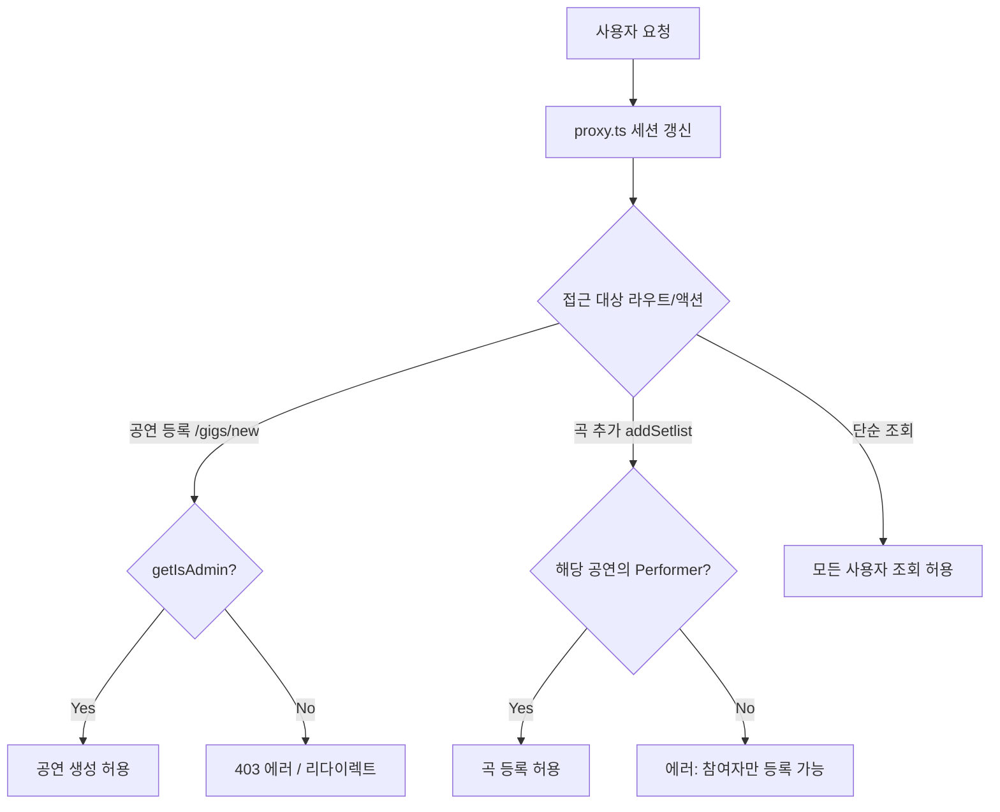

# 역할별 기능 명세서 (Roles & Permissions Guide)

본 문서는 **방문자(비로그인), 일반 회원, 공연 참여자(Performer), 관리자(Admin)** 각 사용자 계층별로 이용 가능한 기능과 권한 범위를 정리한 종합 안내서입니다.

---

## 1. 역할 정의 (Role Definitions)

| 역할 | 정의 | 식별 기준 |
| :--- | :--- | :--- |
| **방문자 (Guest)** | 로그인하지 않은 외부 사용자 또는 일반 방문자 | 세션 없음 |
| **가입 대기자 (Pending)** | 회원가입 신청 완료 후 관리자 승인을 기다리는 사용자 | Supabase `users.status = 'pending'` |
| **일반 회원 (Member)** | 동아리 가입 승인이 완료된 회원 | Supabase `users.status = 'approved'` |
| **공연 참여자 (Performer)** | 특정 공연(`gigs`)에 연주 세션(보컬, 악기 등)으로 배정된 회원 | `public.performers` 테이블에 `gig_id`와 매핑된 회원 |
| **관리자 (Admin)** | 동아리 운영진 또는 시스템 관리자 | `public.admins` 테이블에 등록된 이메일 소유자 |

---

## 2. 역할별 기능 비교 매트릭스 (Feature Matrix)

| 구분 | 세부 기능 | 방문자 | 일반 회원 | 공연 참여자 | 관리자 | 비고 |
| :--- | :--- | :---: | :---: | :---: | :---: | :--- |
| **공통/탐색** | 메인 랜딩 페이지 조회 | O | O | O | O | 동아리 소개 및 비주얼 섹션 |
| | 테마 전환 (Light/Dark) | O | O | O | O | Next-themes 지원 |
| **계정/인증** | 회원가입 (`/auth/sign-up`) | O | X | X | X | 이름, 기수, 파트 입력 |
| | 로그인 / 로그아웃 | O | O | O | O | HttpOnly 세션 쿠키 |
| | 비밀번호 찾기 및 재설정 | O | O | O | O | 이메일 재설정 링크 발송 |
| | **본인 정보 수정 (`/profile`)** | X | **O** | **O** | **O** | 이름, 기수, 세션, 마케팅 동의 수정 |
| **공연 (Gigs)** | 공연 목록 조회 (`/gigs`) | O | O | O | O | 예정된 공연 및 지난 공연 |
| | 공연 D-Day 및 총회 일정 확인 | O | O | O | O | 메인 카드 UI |
| | **신규 공연 등록 (`/gigs/new`)** | X | X | X | **O** | 관리자 전용 권한 |
| | **공연 세션 참여자(Performer) 배정** | X | X | X | **O** | 공연 생성 시 멤버 및 파트 지정 |
| | **공연 LINEUP 프로필 사진 수정** | X | X | **O (본인만)** | **O (전체)** | 본인 카드만 수정/삭제 가능 (관리자는 전체 수정 가능) |
| **선곡 회의** | 셋리스트 목록/상세 조회 | O | O | O | O | 곡별 필수 파트, 악보 유무, 링크 |
| **(Setlists)** | 유튜브 음원/영상 링크 바로가기 | O | O | O | O | 모달 및 드로어에서 확인 |
| | **후보곡 등록/신청 (`addSetlist`)** | X | X | **O** | **O** | 해당 공연 참여자 등록 가능 (관리자는 마감 이후에도 상시 등록 가능) |
| | **본인 등록 곡 삭제 (`deleteSetlist`)** | X | X | **O** | **O** | 본인이 올린 곡만 삭제 가능 |
| | **타인 곡 삭제** | X | X | X | **O** | 관리자 권한으로 삭제 가능 |
| **40주년** | 40주년 기념 공연 안내 및 타임테이블 조회 | O | O | O | O | 카운트다운 타이머, 오시는 길 |
| | 동문/재학생 참석 여부(RSVP) 설문 제출 | O | O | O | O | 참석/불참/미정, 동반인 수 입력 |
| **역사/소개** | 동아리 연혁(Milestones) 및 발자취 조회 | O | O | O | O | 1986년 창립 이래 연혁 타임라인 |
| **역대 부원** | 기수별 역대 부원 명단 조회 (`/members`) | O | O | O | O | 최신 기수순 정렬 |
| | **부원 정보 추가/수정/삭제** | X | X | X | **O** | 관리자 전용 CRUD 모달 |
| | **회원 관리 및 관리자 권한 부여/해제 (`/admin/members`)** | X | X | X | **O** | 가입 승인, 거절 및 관리자 임명/해제 |
| | **회원 정보 수정 (`/admin/members`)** | X | X | X | **O** | 관리자 권한으로 회원 이름, 기수, 세션 수정 |
| **갤러리** | 활동 사진첩 그리드 및 라이트박스 뷰어 | O | O | O | O | 공연/연습 사진 고화질 확대 |
| | **사진 추가/수정/삭제** | X | X | X | **O** | 관리자 전용 CRUD 모달 |
| **알림 (FCM)** | 푸시 알림 수신 권한 동의 | O | O | O | O | 브라우저 권한 팝업 |
| | 기기 FCM 토큰 자동 갱신 | X | O | O | O | `profiles` 테이블 저장 |
| | 공지 알림 수신 | X | O | O | O | 포그라운드/백그라운드 알림 |

> [!NOTE]
> **공연 참여자(Performer)** 권한은 전체 공연에 적용되는 것이 아니라, **해당 공연(`gig_id`)에 참여자로 배정된 경우에만 해당 공연의 셋리스트 권한**을 행사할 수 있습니다.

---

## 3. 사용자 관점의 기능 가이드 (User Journey)

### 3.1 일반 회원 (Member)
1. **동아리 일정 확인**:
   - `/gigs` 페이지에서 다가오는 정기 공연, 버스킹 일정과 곡 선정 총회(미팅) 일정을 확인할 수 있습니다.
2. **지난 공연 아카이브 탐색**:
   - 과거에 진행된 공연 목록과 당시 연주되었던 셋리스트를 열람할 수 있습니다.
3. **알림 수신 설정**:
   - 브라우저 푸시 알림 권한을 허용하여 선곡 회의 시작, 공연 공지 등을 실시간으로 수신받습니다.

### 3.2 공연 참여 세션원 (Performer)
1. **해당 공연 셋리스트 페이지 진입**:
   - `/gigs/[id]/nominations` 페이지로 이동합니다.
2. **후보곡 제안 및 등록**:
   - `곡 추가` 모달을 통해 공연에서 연주하고 싶은 곡을 등록합니다.
   - 곡명, 아티스트, 필요한 악기 파트(보컬, 기타, 베이스, 드럼, 건반 등), 악보 소지 여부, 유튜브 음원 링크, 참고 메모를 작성합니다.
3. **실시간 파트 모집 현황 확인**:
   - 등록된 곡 카드에서 어떤 파트 세션이 필요한지(`PartChip`) 한눈에 파악하고 합주를 조율합니다.
4. **본인 등록 곡 관리**:
   - 본인이 신청한 곡에 한해 내용을 수정하거나 취소(삭제)할 수 있습니다.

---

## 4. 관리자 관점의 기능 가이드 (Admin Operations)

### 4.1 관리자 자격 요건
- Supabase DB의 `admins` 테이블에 등록된 이메일 계정으로 로그인한 사용자만 관리자 기능을 수행할 수 있습니다.
- 백엔드 Server Action에서 `getIsAdmin()` 유틸리티를 호출하여 이중으로 접근을 통제합니다.

### 4.2 신규 공연 개설 (`/gigs/new`)
1. **공연 기본 정보 입력**:
   - 공연명 (예: `2026 봄 정기공연 - 울림`), 공연 일시(`perform_date`), 선곡/준비 총회 일시(`meeting_date`)를 설정합니다.
2. **세션 참여자(Performers) 구성 및 파트 할당**:
   - 회원 목록에서 이번 공연 무대에 오를 멤버들을 검색/선택하고 각각의 담당 파트(보컬, 일렉기타, 베이스, 건반, 드럼 등)를 지정합니다.
   - 공연 개설과 동시에 `gigs` 레코드 생성 및 `performers` 매핑 데이터가 일괄 저장됩니다.

### 4.3 셋리스트 및 공연 관리
1. **공연별 선곡 회의 총괄**:
   - 등록된 후보곡들을 검토하고 파트 편성이 적절한지 모니터링합니다.
   - 중복 제안되거나 부적절한 곡이 있을 경우 관리자 권한으로 삭제할 수 있습니다.
2. **공연 공지 및 알림 발송**:
   - 회원들의 `profiles`에 저장된 FCM 토큰을 통해 선곡 마감 알림이나 공연 공지 푸시를 발송합니다.

---

## 5. 권한 통제 기술 아키텍처

- **서버 사이드 방어 (`Server Actions`)**:
  - 클라이언트 UI가 변조되더라도 서버 액션(`app/gigs/actions.ts`, `app/gigs/[id]/nominations/actions.ts`) 레벨에서 세션 유저의 UUID 및 이메일을 DB와 직접 대조하여 권한이 없는 요청을 완벽히 차단합니다.
