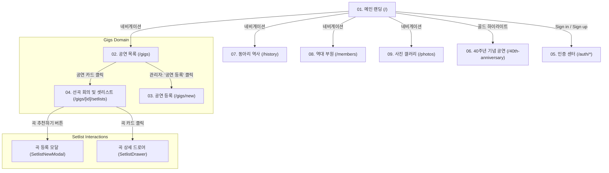

# 페이지별 기능 및 UX 흐름 가이드 (Page & Domain Specs)

본 문서는 SOKNA 웹 애플리케이션의 모든 화면을 **페이지(Domain) 단위로 구조화**하여, 실제 구현된 **디자인 레이아웃, 컴포넌트 계층, 사용자 인터랙션 및 UX 흐름**을 한눈에 추적할 수 있도록 정리한 명세입니다.

---

## 🗺️ 사이트맵 및 사용자 화면 흐름 (Sitemap & User Flow)

---

## 📂 페이지별 명세 문서 목록

| 순번 | 페이지 / 도메인 | URL 경로 | 대상 사용자 | 핵심 기능 및 UX |
| :---: | :--- | :--- | :---: | :--- |
| **01** | [메인 랜딩](./01-landing.md) | `/` | 전체 (방문자/회원) | 동아리 비주얼 브랜딩, 패럴랙스 섹션, 티켓 스타일 예매 CTA |
| **02** | [공연 목록](./02-gigs.md) | `/gigs` | 전체 (방문자/회원/관리자) | 예정/지난 공연 그리드, D-Day 배지, 관리자 전용 등록 CTA |
| **03** | [공연 등록](./03-gig-create.md) | `/gigs/new` | **관리자 전용** | 공연 일정 입력, 회원 검색 및 세션(Performer) 파트 일괄 배정 |
| **04** | [선곡 회의/셋리스트](./04-setlists.md) | `/gigs/[id]/setlists` | **세션 참여자/회원/관리자** | 마감 타이머, 곡 카드 리스트, 곡 제안 모달, 곡 상세 드로어, 악보/링크 |
| **05** | [인증 및 계정](./05-auth.md) | `/auth/*` | 방문자 및 회원 | 회원가입(이름/기수/파트), 로그인, 세션 쿠키 발급, 비밀번호 재설정 |
| **06** | [40주년 기념 공연](./06-40th-anniversary.md) | `/40th-anniversary` | 전체 (동문 OB / 재학생 YB) | D-Day 카운트다운 타이머, 타임테이블, 오시는 길, 사진 아카이브, 참석 설문(RSVP) |
| **07** | [동아리 역사](./07-history.md) | `/history` | 전체 (방문자/회원) | 1986년 창립부터 현재까지 연혁 타임라인 및 마일스톤 |
| **08** | [역대 부원](./08-members.md) | `/members` | 전체 / 관리자 | 기수별 부원 명단 아코디언, 관리자 부원 추가/수정/삭제 CRUD |
| **09** | [갤러리 사진첩](./09-photos.md) | `/photos` | 전체 / 관리자 | 공연/합주 사진 그리드, 라이트박스 확대 뷰어, 관리자 사진 관리 CRUD |

---

## 💡 페이지 명세 작성 표준 원칙
각 페이지 문서는 다음 항목을 필수로 포함합니다:
1. **페이지 기본 정보**: 라우트 경로, 접근 권한, 레이아웃
2. **실제 디자인 레이아웃 (Wireframe & Components)**: 화면 구획 및 스타일링
3. **UX 흐름 및 사용자 인터랙션**: 버튼 클릭, 모달 오픈, 데이터 제출 단계
4. **화면 상태 (UI States)**: Loading, Empty, Normal, Expired/Disabled, Error
5. **백엔드 데이터 흐름**: Supabase 쿼리, Server Action, 캐시 무효화(`revalidatePath`)
6. **관련 컴포넌트 및 소스코드 링크**
